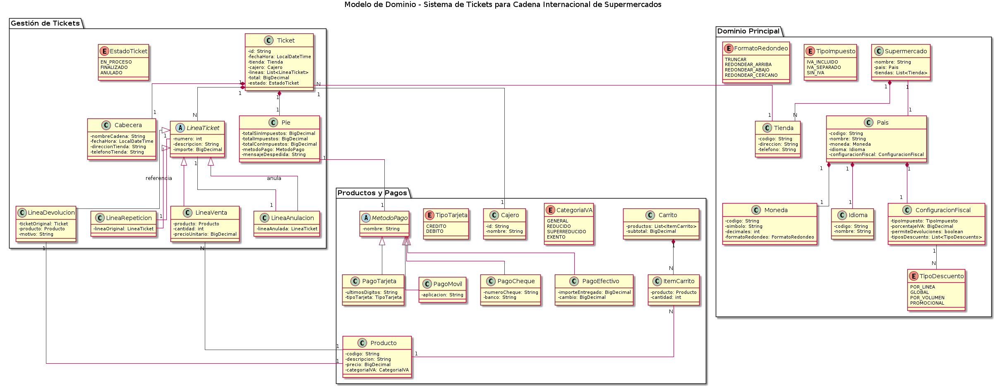
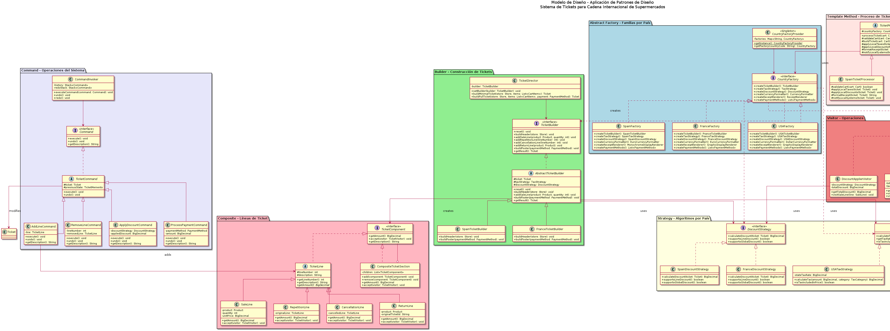

# Patrones de Diseño - Cadena de Supermercados Internacional

Práctica del curso de patrones de diseño: Sistema de tickets para una cadena de supermercados internacional con presencia en más de 20 países.

## Descripción del Proyecto

Este proyecto implementa un **sistema de gestión de tickets** que debe adaptarse a las características y normativas de cada país, manteniendo una arquitectura común y extensible.

### Requisitos del Sistema

El sistema debe gestionar:

- **Necesidades comunes**: carrito de compra, cálculo de totales, generación de recibos, procesamiento de pagos
- **Particularidades locales**:
  - Impuestos (IVA, TVA, Sales Tax)
  - Políticas de descuentos
  - Reglas de redondeo
  - Formato de moneda
  - Idiomas
  - Métodos de pago disponibles
  - Tipos de líneas de ticket permitidas

## Patrones de Diseño Aplicados

### 1. Abstract Factory
**Propósito**: Crear familias de objetos relacionados sin especificar sus clases concretas.

**Aplicación**: `CountryFactory` crea todos los componentes necesarios para un país específico (builder, estrategias de impuestos, descuentos, formateador de moneda, renderizador de recibos).

```java
CountryFactory factory = CountryFactoryProvider.getInstance().getFactory("ES");
TicketBuilder builder = factory.createTicketBuilder();
TaxStrategy taxStrategy = factory.createTaxStrategy();
```

### 2. Builder
**Propósito**: Separar la construcción de objetos complejos de su representación.

**Aplicación**: `TicketBuilder` construye tickets paso a paso con diferentes configuraciones según el país.

```java
builder.buildHeader(store);
builder.addSaleLine(product, quantity);
builder.buildFooter(paymentMethod);
Ticket ticket = builder.getResult();
```

### 3. Strategy
**Propósito**: Definir familias de algoritmos intercambiables.

**Aplicación**: 
- `TaxStrategy`: Diferentes cálculos de impuestos por país
- `DiscountStrategy`: Diferentes políticas de descuentos
- `CurrencyFormatter`: Diferentes formatos de moneda

### 4. Template Method
**Propósito**: Definir el esqueleto de un algoritmo, difiriendo algunos pasos a las subclases.

**Aplicación**: `TicketProcessor` define el proceso de creación de ticket con pasos que varían por país.

```java
public final Ticket processTicket(Cart cart, PaymentMethod payment) {
    validateCart(cart);           // Abstracto
    buildTicket(cart, payment);   // Común
    applyLocalTaxes(ticket);      // Abstracto
    applyLocalDiscounts(ticket);  // Abstracto
    formatReceipt(ticket);        // Abstracto
    notifyLocalSystems(ticket);   // Abstracto
    return ticket;
}
```

### 5. Composite
**Propósito**: Componer objetos en estructuras de árbol para representar jerarquías parte-todo.

**Aplicación**: `TicketComponent` permite tratar líneas individuales y secciones compuestas uniformemente.

### 6. Visitor
**Propósito**: Definir nuevas operaciones sobre una estructura de objetos sin modificar sus clases.

**Aplicación**: 
- `TotalCalculatorVisitor`: Calcula totales
- `PrinterVisitor`: Genera representación textual

### 7. Command
**Propósito**: Encapsular peticiones como objetos para soportar undo/redo.

**Aplicación**: `AddLineCommand`, `RemoveLineCommand`, `ProcessPaymentCommand`

### 8. Singleton
**Propósito**: Garantizar una única instancia de una clase.

**Aplicación**: `CountryFactoryProvider` gestiona las fábricas de países.

## Estructura del Proyecto

```
Ejercicio2/
├── docs/
│   ├── modelo_de_dominio.puml       # Diagrama de dominio
│   └── modelo_de_diseno.puml        # Diagrama de diseño con patrones
├── src/main/java/supermercado/
│   ├── domain/                       # Entidades del dominio
│   │   ├── Product.java
│   │   ├── Ticket.java
│   │   ├── Cart.java
│   │   ├── PaymentMethod.java
│   │   └── ...
│   ├── patterns/
│   │   ├── abstractfactory/          # Patrón Abstract Factory
│   │   │   ├── CountryFactory.java
│   │   │   ├── SpainFactory.java
│   │   │   ├── FranceFactory.java
│   │   │   └── CountryFactoryProvider.java
│   │   ├── builder/                  # Patrón Builder
│   │   │   ├── TicketBuilder.java
│   │   │   ├── AbstractTicketBuilder.java
│   │   │   ├── SpainTicketBuilder.java
│   │   │   └── FranceTicketBuilder.java
│   │   ├── strategy/                 # Patrón Strategy
│   │   │   ├── TaxStrategy.java
│   │   │   ├── DiscountStrategy.java
│   │   │   └── CurrencyFormatter.java
│   │   ├── composite/                # Patrón Composite
│   │   │   ├── TicketComponent.java
│   │   │   ├── TicketLine.java
│   │   │   └── CompositeTicketSection.java
│   │   ├── visitor/                  # Patrón Visitor
│   │   │   ├── TicketVisitor.java
│   │   │   └── TotalCalculatorVisitor.java
│   │   ├── command/                  # Patrón Command
│   │   │   ├── Command.java
│   │   │   └── CommandInvoker.java
│   │   └── templatemethod/           # Patrón Template Method
│   │       ├── TicketProcessor.java
│   │       ├── SpainTicketProcessor.java
│   │       └── FranceTicketProcessor.java
│   ├── Supermarket.java              # Clase principal
│   └── Main.java                     # Demostración
├── pom.xml
└── README.md
```

## Diagramas UML

### Modelo de Dominio


El modelo de dominio captura las entidades principales del negocio:
- **Supermercado** con múltiples **Tiendas** en diferentes **Países**
- **Tickets** compuestos por **Cabecera**, **Líneas** y **Pie**
- Diferentes tipos de **Líneas**: Venta, Repetición, Anulación, Devolución
- **Métodos de pago**: Efectivo, Tarjeta, Móvil

### Modelo de Diseño


El modelo de diseño muestra la aplicación de los patrones:
- Abstract Factory para familias de objetos por país
- Builder para construcción de tickets
- Strategy para algoritmos intercambiables
- Composite + Visitor para operaciones sobre líneas
- Command para operaciones con undo/redo
- Template Method para el proceso de ticket

## Compilación y Ejecución

### Requisitos
- Java 11 o superior
- Maven 3.6 o superior

### Compilar
```bash
cd "Curso de Patrones/Ejercicio2"
mvn clean compile
```

### Ejecutar
```bash
mvn exec:java -Dexec.mainClass="supermercado.Main"
```

### Generar diagramas PNG (requiere PlantUML)
```bash
# Instalar PlantUML si no está disponible
# En Ubuntu/Debian:
sudo apt-get install plantuml

# Generar diagramas
plantuml docs/*.puml
```

## Países Implementados

| País | Código | IVA Incluido | Devoluciones | Descuentos | Display |
|------|--------|--------------|--------------|------------|---------|
| España | ES | True         | True         | Por línea | Monocromo |
| Francia | FR | True         | False        | Globales | Gráfico 12" |

### Extensibilidad

Para añadir un nuevo país:

1. Crear una nueva fábrica implementando `CountryFactory`
2. Implementar las estrategias específicas (`TaxStrategy`, `DiscountStrategy`)
3. Crear el builder específico extendiendo `AbstractTicketBuilder`
4. Crear el procesador específico extendiendo `TicketProcessor`
5. Registrar la fábrica en `CountryFactoryProvider`

## Conceptos de Diseño Aplicados

- **Granularidad**: Separación clara de responsabilidades en cada clase
- **Cohesión**: Alta cohesión en cada componente (una sola responsabilidad)
- **Acoplamiento**: Bajo acoplamiento mediante interfaces y abstracción
- **Principio de Liskov**: Las subclases son sustituibles por sus clases base
- **Principio Abierto/Cerrado**: Extensible sin modificar código existente
- **Inversión de Dependencias**: Dependencia de abstracciones, no de implementaciones

## Referencias

- [Documentación del curso de Patrones de Diseño](https://escuela.it/cursos/patrones)

